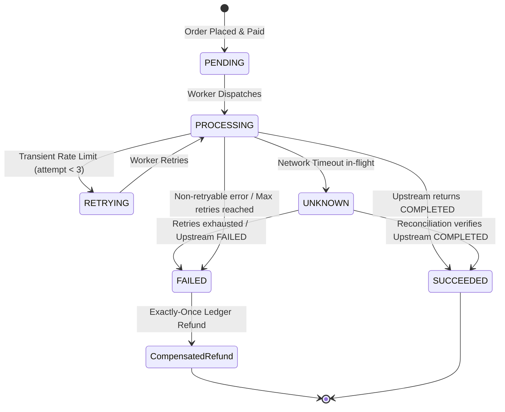

# Fulfillment Engine Architecture

## 1. Overview & Objectives

The **Fulfillment Engine** is responsible for fulfilling paid customer orders through upstream suppliers. Following **Phase 4.1 Production Hardening**, it guarantees:
1. **At-Most-Once Execution:** Strict idempotency preventing duplicate orders or multiple external charges for the same order, including crash-after-acceptance scenarios.
2. **Durable Asynchronous Processing:** Database-backed job queue (`fulfillment_jobs`) surviving application restarts and crashes with automated startup recovery.
3. **Financial Invariance & Refund Idempotency:** Absolute reconciliation between orders, supplier charges, and customer wallets. If fulfillment permanently fails, an automated refund is executed in the double-entry ledger. Duplicate refunds are strictly prevented.
4. **Transparent States & Honest Notifications:** Transient timeouts transition to `UNKNOWN` or `RETRYING` without premature failure or misleading refund notices.

---

## 2. Fulfillment Lifecycle & State Machine

### FulfillmentAttempt Statuses:
- `PENDING`: Initial state upon job enqueueing.
- `PROCESSING`: In flight to the provider.
- `SUCCEEDED`: Confirmed completed upstream with external reference ID and cost amount recorded.
- `RETRYING`: Transient error occurred; scheduled for exponential backoff retry.
- `UNKNOWN`: In-flight network timeout; awaiting provider status verification or reconciliation.
- `FAILED`: Aborted due to permanent error or exhausted retries. Triggers automated ledger refund.

---

## 3. Worker Architecture & Crash Recovery

The `FulfillmentWorker` combines durable database tracking with asynchronous in-memory dispatch:

1. **Transactional Outbox / Durable Storage:** Every `enqueue()` call persists a `FulfillmentJobRecord` in `fulfillment_jobs` with status `QUEUED`.
2. **Crash Recovery (`recover_pending_jobs`):** When the application restarts after an unexpected termination or server crash, the worker scans for any abandoned jobs in `QUEUED` or `RUNNING` status and safely restores them into the active queue.
3. **Exponential Backoff:** If an attempt fails retryably, delay is calculated as:
   $$\text{Delay} = \text{base\_backoff} \times 2^{\text{attempt} - 1}$$
4. **Dead Letter Queue:** If attempts exceed `max_retries` (default: 3), the job record is marked `DEAD_LETTER` with error details for operator inspection.

---

## 4. Double-Entry Ledger Compensation & Refund Idempotency

The platform enforces a strict accounting invariant:

> **The customer must never be charged for an order that cannot be fulfilled, and no refund may ever be credited more than once.**

When an order fulfillment encounters a terminal failure (in `FulfillmentService` or `ReconciliationService`):
1. **Order Transition:** The `Order` transitions to `OrderStatus.FAILED`.
2. **Idempotent Refund:** `LedgerService.refund()` executes with unique `reference_id=str(order.id)` and canonical `reference_type=CANONICAL_REFUND_TYPE` (`"ORDER_FULFILLMENT_REFUND"`).
   - If this refund transaction already exists in the database (whether triggered by fulfillment failure or reconciliation), the existing record is returned without modifying wallet balances.
   - If not yet processed, the user's wallet is credited, restoring funds.
3. **Customer Notification:** The customer receives a clean, user-friendly notification (`ORDER_REFUNDED`). Raw internal exception strings (`str(exc)`) are strictly excluded.

---

## 5. Reconciliation Service

For real-world distributed architectures where workers restart or network partitions obscure API responses:
- `ReconciliationService.scan_and_reconcile_tenant()` queries attempts in `PROCESSING`, `RETRYING`, or `UNKNOWN`.
- Supports querying upstream providers by `external_order_id` OR `idempotency_key` (recovering orders when the app crashed before recording the external order ID).
- If upstream completed: sets attempt `SUCCEEDED` and order `FULFILLED`.
- If upstream failed: sets attempt `FAILED`, order `FAILED`, and triggers automatic ledger refund.
