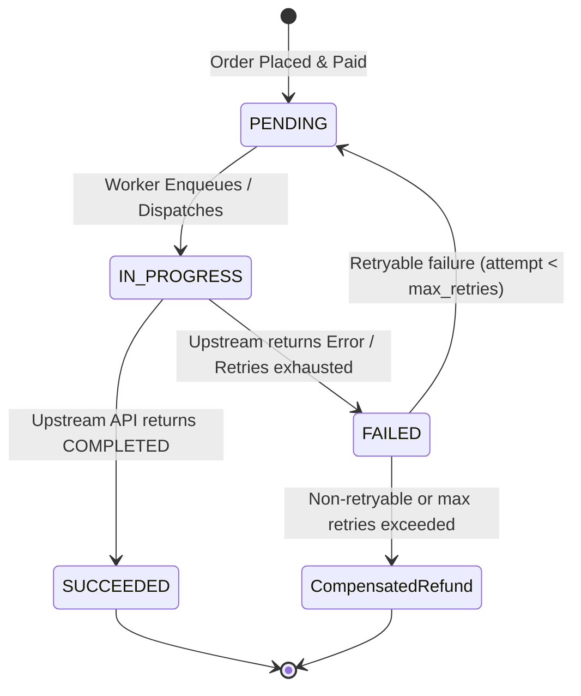

# Fulfillment Engine Architecture

## 1. Overview & Objectives

The **Fulfillment Engine** is responsible for fulfilling paid customer orders through upstream suppliers. It guarantees:
1. **At-Most-Once Execution:** Strict idempotency preventing duplicate orders or multiple external charges for the same order.
2. **Financial Invariance:** Absolute reconciliation between orders, external supplier expenses, and customer wallets. If fulfillment permanently fails, the system automatically executes a compensatory refund in the double-entry ledger.
3. **Resilient Asynchronous Processing:** Background worker queues with exponential backoff and dead-letter handling to withstand upstream vendor outages.

---

## 2. Fulfillment Lifecycle & State Machine

### FulfillmentAttempt Statuses:
- `PENDING`: Initial state upon job enqueueing.
- `IN_PROGRESS`: Currently being processed by `FulfillmentService` and transmitted to the provider.
- `SUCCEEDED`: Confirmed completed upstream with external reference ID and cost amount recorded.
- `FAILED`: Aborted due to error. If non-retryable or retries exceeded, marks order as `CANCELLED` and issues ledger refund.

---

## 3. Worker Architecture & Backoff Strategy

The `FulfillmentWorker` executes in an asynchronous background event loop:

1. **Job Queue:** New orders requiring fulfillment are placed into an in-memory queue (`asyncio.Queue[FulfillmentJob]`).
2. **Exponential Backoff:** If an attempt fails with a retryable exception (`ProviderTimeoutError` or `ProviderRateLimitError`), the worker calculates delay using exponential backoff:
   $$\text{Delay} = \text{base\_backoff} \times 2^{\text{attempt} - 1}$$
3. **Dead Letter Queue:** If attempts exceed `max_retries` (default: 3), the job is moved to `dead_letter_queue` for operator inspection, and the order is permanently failed and refunded.

---

## 4. Double-Entry Ledger Compensation Invariant

The platform enforces a strict accounting invariant:

> **The customer must never be charged for an order that cannot be fulfilled.**

When an order fulfillment encounters a terminal failure (such as invalid recipient, out of stock across all providers, or exhausted retries):

1. **Order Transition:** The `Order` transitions from `PAID` $\rightarrow$ `CANCELLED`.
2. **Ledger Compensation:** `LedgerService.refund()` executes within the same atomic database transaction:
   - A new credit ledger transaction is written to the customer's wallet.
   - The user's wallet balance increases back to its pre-purchase amount.
   - The double-entry transaction record explicitly references `order_id` and reason `"Fulfillment failed"`.
3. **Customer Notification:** An automated `ORDER_REFUNDED` notification is dispatched to the customer via Telegram or active notification transport.

---

## 5. Reconciliation Service

For real-world distributed architectures where workers might restart or external provider callbacks may be delayed, `ReconciliationService` runs periodic checks:
- Queries for orders in `PAID` state with no successful fulfillment attempt older than a threshold (e.g., 5 minutes).
- Queries upstream providers via `provider.get_order(external_id)` to synchronize out-of-band status updates.
- If verified completed upstream, marks order as `FULFILLED`. If verified cancelled or rejected upstream, triggers automatic ledger refund.
