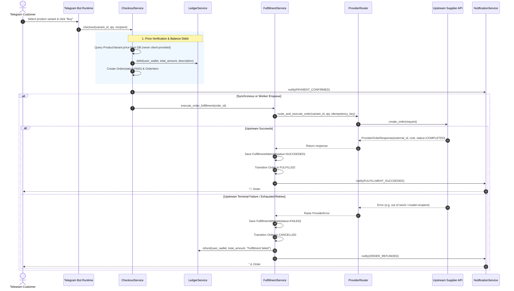

# End-to-End Order Lifecycle Architecture

## 1. Overview

This document details the end-to-end lifecycle of an order within the **GH-Bot-Factory** ecosystem, from initial Telegram user interaction through cart checkout, double-entry wallet debit, provider routing, external fulfillment, and automated financial compensation.

---

## 2. Complete Sequence Flow

---

## 3. Detailed Phase Breakdown

### Phase 1: Authoritative Catalog Price Lookup
- The client or Telegram callback passes only `variant_id` and `quantity`.
- `CheckoutService` queries the authoritative database record for `ProductVariant` strictly scoped to the active `tenant_id`.
- Client-supplied prices are strictly rejected to eliminate price tampering vulnerabilities.

### Phase 2: Double-Entry Ledger Debit
- `LedgerService.debit()` checks if the customer's wallet balance covers `total_amount`.
- If insufficient balance, `InsufficientFundsError` is raised immediately before order creation.
- A new immutable debit transaction is recorded with correlation to `order_id`.

### Phase 3: Order Instantiation & State Transition
- The `Order` is saved in state `PAID`.
- An associated `OrderItem` is created with frozen unit prices.

### Phase 4: Provider Routing & Idempotent Execution
- `FulfillmentService` creates an initial `FulfillmentAttempt` record.
- The `idempotency_key` is calculated as:
  $$\text{idempotency\_key} = \text{"order:\{order.id\}:attempt:\{attempt\_number\}"}$$
- If this key was previously dispatched, the upstream client replays the recorded response, preventing duplicate purchases.
- `ProviderRouter` traverses active mappings ordered by `priority ASC`.

### Phase 5: Terminal Resolution & Financial Settlement
- **On Success:**
  - `FulfillmentAttempt.status` $\rightarrow$ `SUCCEEDED`.
  - `Order.status` $\rightarrow$ `FULFILLED`.
  - Upstream cost and supplier reference ID are committed to the database.
- **On Permanent Failure:**
  - `FulfillmentAttempt.status` $\rightarrow$ `FAILED`.
  - `Order.status` $\rightarrow$ `CANCELLED`.
  - `LedgerService.refund()` automatically restores the wallet balance with a corresponding credit ledger entry.
