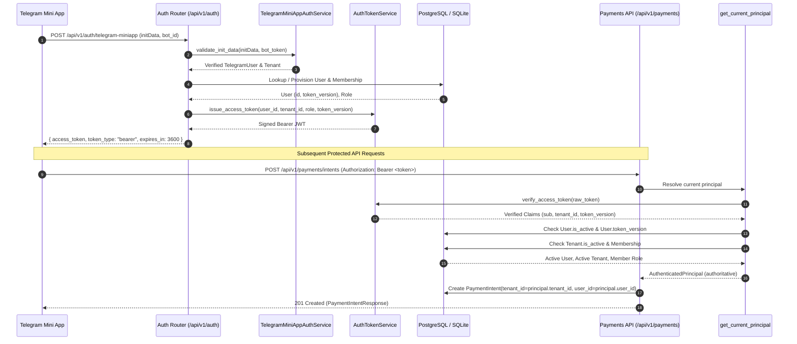

# Payment Architecture & Multi-Client API Specification

## 1. Architectural Overview

The GH-Bot-Factory Payment Infrastructure provides a provider-agnostic, multi-tenant payment framework designed to serve multiple consumer frontends:
- **Telegram Bot:** AI-guided conversational checkout.
- **Telegram Mini App (TMA):** WebApp interfaces with rich catalog browsing and checkout.
- **Admin Panel:** Merchant administration, dispute management, manual reconciliation.
- **External Clients:** Third-party partner webhooks and API integrations.

```
+------------------+    +-------------------+    +----------------+
|  Telegram Bot    |    | Telegram Mini App |    |  Admin Panel   |
+--------+---------+    +---------+---------+    +-------+--------+
         |                        |                      |
         +-------------------+    |    +-----------------+
                             |    |    |
                             v    v    v
                   +-----------------------+
                   |   FastAPI Gateway     |
                   |      /api/v1/         |
                   +-----------+-----------+
                               | (Bearer JWT / AuthenticatedPrincipal)
                   +-----------v-----------+
                   |    PaymentService     |
                   +-----------+-----------+
                               |
         +---------------------+---------------------+
         |                     |                     |
         v                     v                     v
+-----------------+   +------------------+   +----------------+
|  PaymentIntent  |   |  PaymentProvider |   |  LedgerService |
|  State Machine  |   |     Registry     |   |   Settlement   |
+-----------------+   +--------+---------+   +----------------+
                               |
                     +---------+---------+
                     |                   |
                     v                   v
            +-----------------+ +------------------+
            |  Mock Provider  | |  Gateway Adapter |
            +-----------------+ +------------------+
```

Core modules:
- [`PaymentIntent`](file:///home/it/Coding/gh-bot-factory/packages/payments/models.py#L130): Authoritative payment attempt bound to tenant and order.
- [`PaymentStateMachine`](file:///home/it/Coding/gh-bot-factory/packages/payments/state_machine.py#L58): Governs valid lifecycle transitions.
- [`PaymentService`](file:///home/it/Coding/gh-bot-factory/packages/payments/payment_service.py#L54): Coordinates checkout, webhooks, settlements, and gateway refunds.
- [`PaymentProvider`](file:///home/it/Coding/gh-bot-factory/packages/payments/providers/interface.py#L67): Pluggable gateway protocol.
- [`PaymentProviderRegistry`](file:///home/it/Coding/gh-bot-factory/packages/payments/providers/registry.py#L22): Factory and cache for tenant provider adapters.
- [`PaymentReconciliationService`](file:///home/it/Coding/gh-bot-factory/packages/payments/reconciliation.py#L19): Reconciles uncertain payment intents against provider gateways.
- [`LedgerService`](file:///home/it/Coding/gh-bot-factory/packages/payments/service.py#L24): Financial ledger engine enforcing settlement idempotency.
- [`TelegramMiniAppAuthService`](file:///home/it/Coding/gh-bot-factory/packages/telegram/miniapp.py#L29): Server-side cryptographic HMAC-SHA256 validator for Mini Apps.
- [`AuthTokenService`](file:///home/it/Coding/gh-bot-factory/packages/core/auth.py#L91): Cryptographic JWT access token signer, verifier, and claims manager.
- [`AuthenticatedPrincipal`](file:///home/it/Coding/gh-bot-factory/packages/core/auth.py#L64): Immutable caller context representing authenticated user, tenant, and roles.
- [`get_current_principal`](file:///home/it/Coding/gh-bot-factory/apps/api/deps.py#L23): FastAPI dependency enforcing Bearer token verification, session revocation, and tenant membership.

---

## 2. Payment Intent Lifecycle & State Machine

Every checkout attempt generates a durable [`PaymentIntent`](file:///home/it/Coding/gh-bot-factory/packages/payments/models.py#L130) entity scoped strictly to `tenant_id` and `order_id`.

### State Machine Specification
```
[CREATED] ───► [PENDING] ───► [PROCESSING] ───► [SUCCEEDED] (Terminal)
   │               │               │
   ├──► [CANCELLED] ├──► [CANCELLED] ├──► [CANCELLED]
   │               │               │
   ├──► [EXPIRED]   ├──► [EXPIRED]   ├──► [EXPIRED]
   │               │               │
   └──► [FAILED]    ├──► [FAILED]    ├──► [FAILED]
                   │               │
                   └──► [UNKNOWN] ◄┘
                           │
                 (Reconciliation Service)
                           │
                    [SUCCEEDED] / [FAILED]
```

### Invariants:
1. **Server-Authoritative Amounts:** `PaymentIntent.amount` and `PaymentIntent.currency` are derived directly from [`Order.total_amount`](file:///home/it/Coding/gh-bot-factory/packages/commerce/models.py#L106) and [`Order.currency`](file:///home/it/Coding/gh-bot-factory/packages/commerce/models.py#L105). Client-submitted amounts are strictly rejected.
2. **At Most One Active Intent:** Partial unique index `uq_active_order_payment_intent` ensures only one intent in `('CREATED', 'PENDING', 'PROCESSING')` can exist per `(tenant_id, order_id)`.
3. **Immutability of Terminal Succeeded State:** Once settled (`SUCCEEDED`), an intent cannot be moved back to `PENDING`, `PROCESSING`, or `FAILED`.

---

## 3. Webhook Processing & Security

Webhooks represent asynchronous gateway callbacks informing the platform of payment settlement, authorization, or failure.

### Processing Pipeline:
```
Incoming Webhook
      │
      ▼
1. Candidate Tenant Resolution (Path / Query / Header)
      │
      ▼
2. Resolve Tenant Gateway Config (PaymentProviderConfig)
      │
      ▼
3. Verify Cryptographic Signature (HMAC-SHA256 / Gateway Webhook Secret)
      │  (Fails ➔ WebhookVerificationError, 401 Unauthorized)
      ▼
4. Compute SHA256 Payload Hash & Deduplicate (uq_webhook_tenant_provider_event)
      │  (Duplicate ➔ Return existing PaymentWebhookEvent, idempotent 200)
      ▼
5. Load Tenant-Scoped PaymentIntent
      │
      ▼
6. Authoritative Verification (Amount == Intent.amount, Currency == Intent.currency)
      │  (Mismatch ➔ PaymentIntegrityError, 409 Conflict)
      ▼
7. State Machine Transition & Ledger Settlement
      │
      ▼
8. Mark Webhook Processed (processed=True, processed_at=now)
```

### Webhook-First Race Handling:
If the webhook arrives and settles the payment before the user's browser or Mini App redirects back to the application:
1. The webhook transitions `PaymentIntent.status` to `SUCCEEDED` and executes [`LedgerService.settle_payment()`](file:///home/it/Coding/gh-bot-factory/packages/payments/service.py#L93).
2. When the user later returns and calls the return/settlement endpoint, `PaymentService.settle_payment_intent()` detects that the intent is already `SUCCEEDED` and returns the existing transaction without executing a duplicate credit.
3. Conversely, if the user returns first, the subsequent webhook detects that the intent is settled, and `LedgerService.settle_payment()` enforces single credit via database partial unique index `uq_settlement_idempotency`.

---

## 4. Ledger Settlement & Double-Entry Invariance

Ledger settlement converts external fiat or crypto payment into internal accounting reality:
- **Ledger Invariant:** Exactly one successful payment settlement corresponds to exactly one [`LedgerTransaction`](file:///home/it/Coding/gh-bot-factory/packages/payments/models.py#L73) credit.
- **Database Enforced Idempotency:**
  ```sql
  CREATE UNIQUE INDEX uq_settlement_idempotency 
  ON ledger_transactions(wallet_id, reference_type, reference_id)
  WHERE transaction_type = 'CREDIT' 
    AND reference_type = 'PAYMENT_SETTLEMENT' 
    AND reference_id IS NOT NULL;
  ```
- **Atomicity via Savepoints:** [`LedgerService.settle_payment()`](file:///home/it/Coding/gh-bot-factory/packages/payments/service.py#L93) wraps the wallet credit in a nested transaction. If a concurrent worker hits the index collision, the balance modification is cleanly rolled back and the winning transaction is returned.

---

## 5. Accounting Distinction: Gateway vs Fulfillment Refunds

| Attribute | Order Fulfillment Refund | Payment Gateway Refund |
| :--- | :--- | :--- |
| **Canonical Type** | `ORDER_FULFILLMENT_REFUND` | `PAYMENT_REFUND` |
| **Trigger** | Upstream supplier fulfillment failure | Merchant cancellation / customer dispute |
| **Funds Source** | Internal merchant wallet liability | External payment gateway reversed funds |
| **Idempotency Identity** | `order_id` | `payment_intent_id` |
| **Database Index** | `uq_refund_idempotency` | `uq_refund_idempotency` |

---

## 6. Telegram Mini App Authentication Boundary

Telegram Mini Apps transmit session authentication via `window.Telegram.WebApp.initData`.

### Validation Algorithm:
1. Parse URL-encoded query parameters.
2. Extract the received `hash`.
3. Alphabetically sort remaining key-value pairs separated by newlines (`data_check_string`).
4. Generate `secret_key = HMAC_SHA256(b"WebAppData", bot_token)`.
5. Compute `computed_hash = HMAC_SHA256(secret_key, data_check_string)`.
6. Assert `hmac.compare_digest(computed_hash, received_hash)`.
7. Enforce timestamp freshness: `now - auth_date <= 86400s` and `auth_date <= now + 300s`.
8. Resolve `tenant_id` from the registered [`Bot`](file:///home/it/Coding/gh-bot-factory/packages/telegram/models.py#L12) entity. The client cannot forge or supply `tenant_id`.

---

## 7. API Authentication & Authorization Architecture (Phase 5.1 Hardening)

Phase 5.1 eliminates all reliance on client-supplied identity headers (`X-Tenant-ID`, `X-User-ID`). All customer-facing and administrative API operations require cryptographically signed Bearer JWT access tokens validated against the database for session revocation and tenant membership.

### 7.1 The 5 Security Invariants
1. **Identity Law:** *«Client-supplied user/tenant IDs are never authoritative.»*
   - Clients cannot specify `user_id` or `tenant_id` in headers, query parameters, or request bodies to assert identity.
2. **Authorization Law:** *«Every customer API operation is authorized against the authenticated principal.»*
   - Payment intents, cancellations, and reconciliations are strictly scoped to `principal.user_id` and `principal.tenant_id`. Customers cannot access or alter another customer's resources.
3. **Mini App Law:** *«Telegram "initData" is authenticated cryptographically before deriving identity.»*
   - Telegram's HMAC-SHA256 signature is verified against the owning bot's secret token before user provisioning or token issuance.
4. **Webhook Law:** *«Payment gateway webhooks are authenticated with provider-specific cryptographic verification and tenant/provider binding.»*
   - Gateway webhooks belong to a separate trust boundary. They are authenticated via gateway-specific signatures against the tenant's configured secret, never customer JWTs.
5. **Tenant Law:** *«Authenticated tenant context cannot be overridden by request headers/body/query parameters.»*
   - API operations execute strictly within `principal.tenant_id`. Header overrides or parameter tampering are rejected.

---

### 7.2 Mini App Authentication & API Authorization Flow



**Text-Based Flowchart:**
```
+---------------------------+
| Telegram Mini App initData|
+-------------+-------------+
              | (POST /api/v1/auth/telegram-miniapp)
              v
+-----------------------------------+
| Cryptographic Authentication      |
| (HMAC-SHA256 with Bot Token)      |
+-------------+-------------+
              |
              v
+-----------------------------------+
| Authenticated Principal           |
| (User, Tenant, Role Resolution)   |
+-------------+-------------+
              |
              v
+-----------------------------------+
| Bearer Access Token Issuance      |
| (AuthTokenService signed JWT)     |
+-------------+-------------+
              | (Authorization: Bearer <token>)
              v
+-----------------------------------+
| Authorized API Requests           |
| (Enforced via get_current_principal)
+-----------------------------------+
```

---

### 7.3 Two Distinct Trust Boundaries: Customer Auth vs Provider Webhooks

A fundamental security principle of GH-Bot-Factory is the architectural separation of customer session authentication from external payment gateway webhook authentication:

```
┌─────────────────────────────────────────────────────────────────────────┐
│                    TRUST BOUNDARY A: CUSTOMER SESSIONS                  │
│                                                                         │
│  Client (Mini App / Web)  ───[ Bearer JWT ]───►  /api/v1/payments/*     │
│  - Identity: AuthenticatedPrincipal (sub=user_id, tenant_id)             │
│  - Verification: AuthTokenService (HS256 server secret)                 │
│  - Revocation: User.token_version check against DB                      │
│  - Authorization: RBAC (Customer ownership isolation)                   │
└─────────────────────────────────────────────────────────────────────────┘

┌─────────────────────────────────────────────────────────────────────────┐
│                 TRUST BOUNDARY B: PAYMENT GATEWAY WEBHOOKS              │
│                                                                         │
│  Payment Gateway (Stripe) ───[ Gateway Signature ]───► /webhooks/{p}    │
│  - Identity: External Gateway Provider (Stripe, Stars, etc.)            │
│  - Verification: Provider-specific HMAC / public key                    │
│  - Secret Source: Tenant's PaymentProviderConfig.webhook_secret_ref     │
│  - Tenant Binding: Cryptographically verified against tenant secret     │
│  - Deduplication: uq_webhook_tenant_provider_event partial index       │
│  - Authorization: System-level settlement (No customer JWT accepted)    │
└─────────────────────────────────────────────────────────────────────────┘
```

| Security Dimension | Trust Boundary A: Customer API | Trust Boundary B: Gateway Webhooks |
| :--- | :--- | :--- |
| **Actor** | Customer / Merchant Admin / Staff | External Payment Gateway Server |
| **Credential Type** | Bearer JWT Access Token | HTTP Header Signature (HMAC / Asymmetric) |
| **Secret Used** | Server application `JWT_SECRET_KEY` | Tenant's configured gateway `webhook_secret` |
| **Revocation** | Instant via `User.token_version` increment | Key rotation in `PaymentProviderConfig` |
| **Authority Scope** | Limited to customer's own orders/intents | System-level state machine settlement |
| **Client Headers** | `Authorization: Bearer <token>` | Provider signature (`Stripe-Signature`, etc.) |

---

### 7.4 Session Revocation via `token_version`
To revoke user sessions immediately across all active devices without the overhead of maintaining an in-memory or Redis blocklist:
1. Every `User` record contains an integer `token_version` (schema managed by [`b7e3a912f45c_add_user_token_version.py`](file:///home/it/Coding/gh-bot-factory/migrations/versions/b7e3a912f45c_add_user_token_version.py)).
2. Upon JWT issuance, `token_version` is embedded in the token claims.
3. On every request, [`get_current_principal`](file:///home/it/Coding/gh-bot-factory/apps/api/deps.py#L23) verifies `payload["token_version"] == user.token_version`.
4. Incrementing `user.token_version` invalidates all previously issued tokens instantly with `401 Unauthorized`.

---

## 8. Multi-Client Unified REST API Specification

All frontends interface through the standardized FastAPI routes defined under [`apps/api/v1/payments.py`](file:///home/it/Coding/gh-bot-factory/apps/api/v1/payments.py) and [`apps/api/v1/auth.py`](file:///home/it/Coding/gh-bot-factory/apps/api/v1/auth.py):

| Method | Endpoint | Authentication / Credentials | Request Body | Status Code | Purpose |
| :--- | :--- | :--- | :--- | :--- | :--- |
| `POST` | `/api/v1/auth/telegram-miniapp` | Public endpoint (verifies TMA cryptographic signature) | `TelegramMiniAppAuthRequest` (`init_data`, `bot_id`, `expected_tenant_id`) | 200 OK | Authenticates TMA `initData`, provisions user, and issues signed Bearer access token |
| `POST` | `/api/v1/payments/intents` | `Authorization: Bearer <token>` | `CreatePaymentIntentRequest` (`order_id`, `provider_name`, `idempotency_key`, `metadata`, `return_url`) | 201 Created | Creates intent with server-authoritative amount from `Order` bound to `principal` |
| `GET` | `/api/v1/payments/intents/{intent_id}` | `Authorization: Bearer <token>` | None | 200 OK | Fetches intent status. Customers can only access their own intents (403 otherwise) |
| `POST` | `/api/v1/payments/{intent_id}/cancel` | `Authorization: Bearer <token>` | None | 200 OK | Cancels active intent. Customers can only cancel their own intents |
| `POST` | `/api/v1/payments/{intent_id}/reconcile` | `Authorization: Bearer <token>` | None | 200 OK | Reconciles intent against provider. Customers can only reconcile their own intents |
| `POST` | `/api/v1/payments/webhooks/{tenant_id}/{provider_name}` | Gateway Cryptographic Signature | Raw gateway webhook payload (JSON/bytes) | 200 OK | Path-based candidate tenant webhook ingestion and cryptographic verification |
| `POST` | `/api/v1/payments/webhooks/{provider_name}` | Gateway Cryptographic Signature | Raw gateway webhook payload (JSON/bytes) | 200 OK | Candidate tenant webhook ingestion (via header or query) with cryptographic verification |

---

## 9. Database Invariants & Concurrency Constraints

The database schema enforces financial, concurrency, and authentication guarantees at the engine level:

1. **User Token Versioning:**
   `users.token_version` integer column (default 1) enabling instant token invalidation.
2. **Payment Intent Idempotency:**
   `uq_payment_intent_tenant_idempotency` on `payment_intents(tenant_id, idempotency_key)`
3. **Active Order Payment Intent Uniqueness:**
   `uq_active_order_payment_intent` on `payment_intents(tenant_id, order_id)` WHERE `status IN ('CREATED', 'PENDING', 'PROCESSING')`
4. **Webhook Deduplication Uniqueness:**
   `uq_webhook_tenant_provider_event` on `payment_webhook_events(tenant_id, provider, provider_event_id)`
5. **Ledger Settlement Idempotency:**
   `uq_settlement_idempotency` on `ledger_transactions(wallet_id, reference_type, reference_id)` WHERE `transaction_type = 'CREDIT' AND reference_type = 'PAYMENT_SETTLEMENT' AND reference_id IS NOT NULL`
6. **Ledger Refund Idempotency:**
   `uq_refund_idempotency` on `ledger_transactions(wallet_id, reference_type, reference_id)` WHERE `transaction_type = 'REFUND' AND reference_type IS NOT NULL AND reference_id IS NOT NULL`

---

## 10. Verification & Migration Safety

- **Migrations:**
  - [`migrations/versions/a8d5f418df6f_add_payment_infrastructure_and_.py`](file:///home/it/Coding/gh-bot-factory/migrations/versions/a8d5f418df6f_add_payment_infrastructure_and_.py): Payment tables, partial unique indexes, provider configs.
  - [`migrations/versions/b7e3a912f45c_add_user_token_version.py`](file:///home/it/Coding/gh-bot-factory/migrations/versions/b7e3a912f45c_add_user_token_version.py): User session epoch column (`token_version`).
- **Test Suite:** Async Pytest test suite covering payment intent lifecycles, settlement idempotency, HMAC verification, JWT token issuance, session revocation, and customer ownership isolation.
