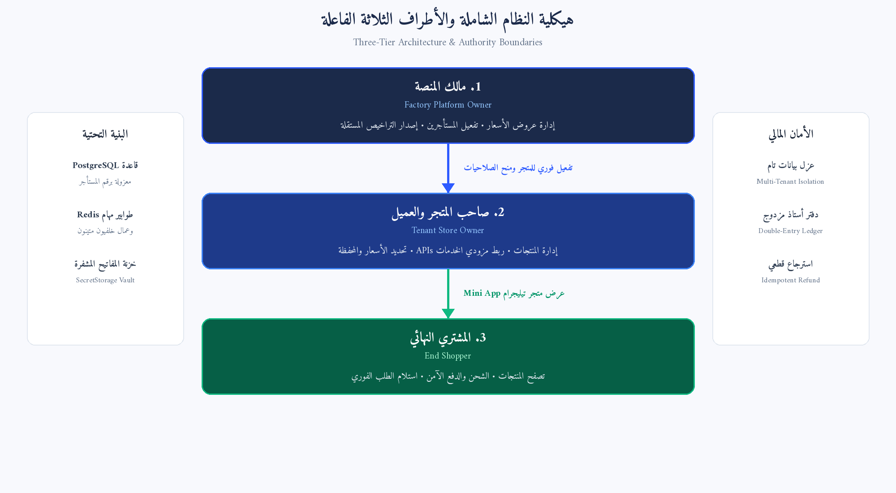
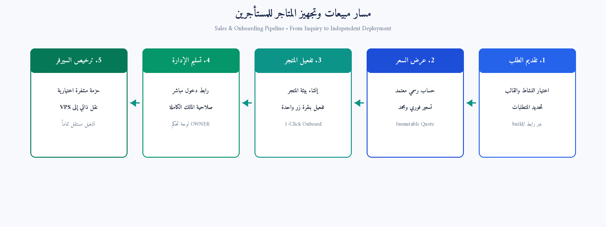
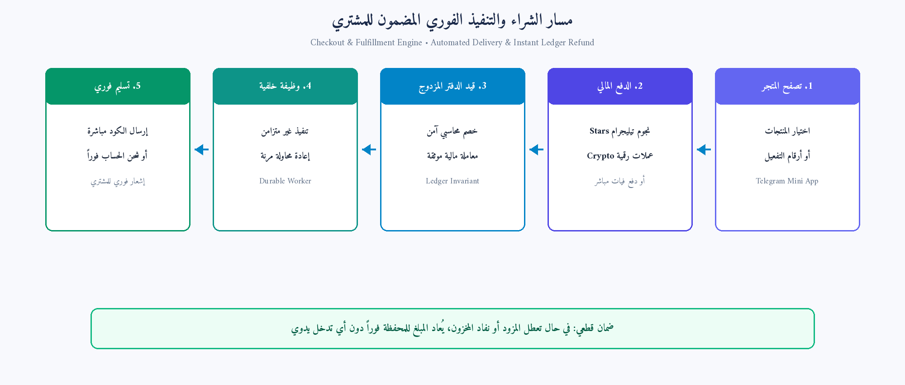

# دليل مسارات وتشغيل منصة GH-Bot-Factory
> تقرير تنفيذي مصور يوضح المسارات الكاملة لجميع أطراف النظام بالرسومات والمخططات

---

## 1. نظرة عامة وهيكلية النظام (Overview)

مشروع **GH-Bot-Factory** هو منصة تجارة رقمية متكاملة متعددة المستأجرين (Multi-Tenant) مبنية خصيصاً لمنظومة تيليجرام (Telegram Bots & Mini Apps). ينقسم النظام إلى ثلاثة أطراف فاعلة أساسية، لكل طرف مسار عمل واضح ومستقل:

| الطرف الفاعل | الدور والصلاحية | الواجهات المستخدمة |
| :--- | :--- | :--- |
| **مالك المنصة (Factory Owner)** | التحكم بالمنصة المركزية، استلام طلبات العملاء، إنشاء عروض الأسعار، وإعداد استضافة المتاجر أو تسليم الكود. | لوحة التحكم (`/admin`)، أداة الأوامر (`platformctl`) |
| **صاحب المتجر (Tenant Owner)** | إدارة المتجر الخاص به، تحديد الهوية والاسم، إضافة المنتجات المخزنة، ربط المزودين (APIs)، وتفعيل بوابات الدفع. | لوحة المتجر (`/admin`)، أمر التيليجرام (`/admin`) |
| **المشتري النهائي (Shopper)** | تصفح المنتجات في تيليجرام، شحن المحفظة الرقمية، الشراء الفوري، واستلام الأكواد/البضاعة الرقمية مباشرة. | تطبيق تيليجرام المصغر (Mini App) وبوت المتجر |

### مخطط هيكلية النظام العامة

---

## 2. مسار مالك المنصة (Factory Owner Flow)

1. **استقبال طلبات العملاء الجدد:**
   - يدخل العميل المحتمل إلى صفحة بناء البوتات (`/build`) ويحدد نوع البوت (تخزين، مزودين، هجين)، البوابات، ونوع الاستضافة. يُسجل الطلب تلقائياً في قاعدة البيانات كـ (`Inquiry`).
2. **مراجعة الطلب وتقديم عرض السعر الرسمي (Commercial Quote):**
   - يقوم المالك بمراجعة تفاصيل الطلب عبر لوحة "Sales & Leads" أو عبر الطرفية (`platformctl inquiries`)، ثم ينشئ عرض سعر غير قابل للتلاعب (`Immutable Quote`) يحتوي على رسوم التجهيز لمرة واحدة ورسوم الاشتراك الشهري.
3. **التفعيل الفوري للمتجر (1-Click Tenant Onboarding):**
   - بمجرد موافقة العميل، يضغط المالك على زر `🚀 Onboard Tenant`. يقوم النظام تلقائياً بإنشاء المتجر (`Tenant`)، تسجيل حساب العميل بصفة (`OWNER`)، تجهيز قالب البوت، وإصدار رابط دخول فوري للعميل.
4. **التصدير للاستضافة المستقلة (Dedicated / Source License):**
   - في حال اشترى العميل خدمة الاستضافة على سيرفره الخاص (VPS) أو رخصة الكود: يولد المالك حزمة مشفرة (`tenant-bundle`) برقم ترخيص مشفر، ويتم إيقاف الربط بالمنصة السحابية لتشغيلها بسلاسة على سيرفر العميل المستقل.

### مخطط دورة حياة المبيعات وتجهيز المتاجر

---

## 3. مسار صاحب المتجر (Store Owner Flow)

1. **الدخول السلس والأمن:**
   - يدخل صاحب المتجر عبر إرسال أمر `/admin` إلى بوت المتجر في تيليجرام ليحصل على رابط دخول مباشر بنقرة واحدة، أو من خلال اسم المستخدم وكلمة المرور في المتصفح.
2. **إدارة الهوية والتخصيص:**
   - تعديل اسم المتجر، الشعار، الألوان الرئيسية (`Brand Accent`)، والتصنيفات بما يناسب طبيعة تجارته.
3. **إضافة المنتجات المخزنة (Stored Products):**
   - إضافة حسابات جاهزة، أكواد اشتراكات، بطاقات رقمية، أو ملفات، مع تتبع آلي للمخزون ومنع البيع المزدوج.
4. **ربط المزودين الآليين (API Providers):**
   - ربط مزودي أرقام SMS، بطاقات الألعاب، والخدمات الآلية عبر إدخال المفاتيح المشفرة مباشرة، مع وضع هوامش الربح التلقائية (`Markup Formula`).
5. **تفعيل طرق الدفع:**
   - تفعيل نجوم تيليجرام (`Telegram Stars`)، الدفع بالعملات الرقمية المشفرة (`Crypto`)، أو الدفع المحلي والفيات، مع تحديد رصيد المحافظ وسعر الصرف.

---

## 4. مسار المشتري النهائي (Shopper Flow)

1. **فتح المتجر:**
   - يضغط المشتري على زر "فتح المتجر" داخل محادثة البوت، فيفتح تطبيق تيليجرام المصغر (`Mini App`) فوراً دون الحاجة لتسجيل حساب خارجي.
2. **تصفح واختيار المنتجات:**
   - استعراض الأقسام، رؤية الأسعار المحدثة، واختيار المنتج أو الدولة المطلوبة (في خدمات الأرقام والتطبيقات).
3. **الدفع وشحن المحفظة:**
   - الدفع عبر الرصيد الداخلي أو شحن المحفظة بنجوم تيليجرام أو الكريبتو. يتم قيد المبلغ بدفتر أستاذ محاسبي مزدوج (`Double-Entry Ledger`) يضمن عدم ضياع أي قرش.
4. **التنفيذ والتسليم الفوري:**
   - بمجرد إتمام الدفع، تتولى وظيفة خلفية (`Background Job`) تسليم الكود الرقمي أو سحب الخدمة من المزود وعرضها فوراً في شاشة المشتري مع زر نسخ فوري.
5. **الضمان المالي والاسترجاع الذاتي:**
   - في حال تعطل المزود الخارجي أو انتهاء وقت التفعيل، يقوم النظام تلقائياً وبشكل قطعي بإعادة كامل المبلغ لمحفظة المشتري دون أي تدخل يدوي.

### مخطط دورة الشراء والتنفيذ الفوري المضمون

---

## 5. القواعد الذهبية والأمان في المنصة (Core Guarantees)

- ✓ **عزل تام للبيانات (`Multi-Tenant Isolation`):** كل متجر معزول كلياً بقاعدة البيانات بواسطة `tenant_id`، ولا يمكن لأي عميل أو تاجر الاطلاع على بيانات متجر آخر.
- ✓ **دفتر حسابات مالي لا يخطئ (`Double-Entry Ledger`):** لا يتم تعديل أرصدة المحافظ مباشرة، بل عبر قيود مالية غير قابلة للتعديل أو التكرار (`Strict Idempotency`).
- ✓ **حماية المفاتيح والأسرار (`Zero Plaintext Secrets`):** مفاتيح التيليجرام والمزودين لا تُخزن في قاعدة البيانات ولا تظهر في المتصفح، بل تُشفر في خزنة محلية مؤمنة (`SecretStorage`).
- ✓ **تنفيذ خلفي مرن ضد الانقطاع (`Durable Workers`):** تتم عمليات الشراء ومخاطبة المزودين عبر طوابير مهام خلفية في Redis/DB لضمان عدم تعليق واجهة المستخدم حتى عند بطء الشبكة.
